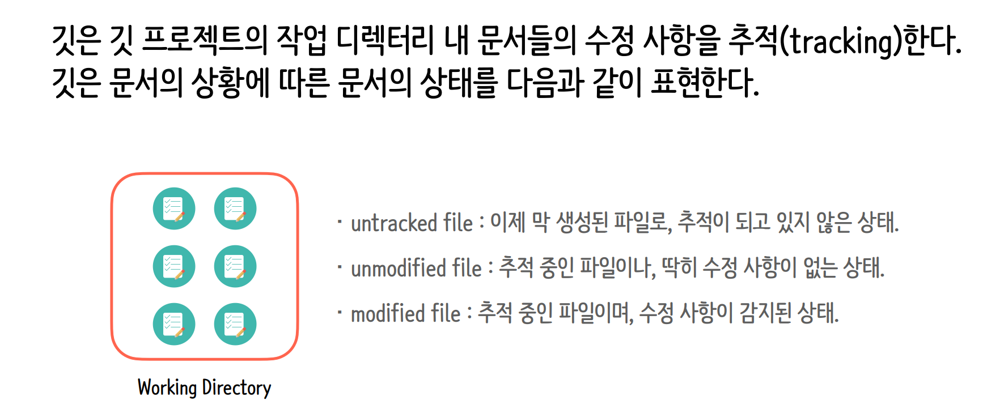
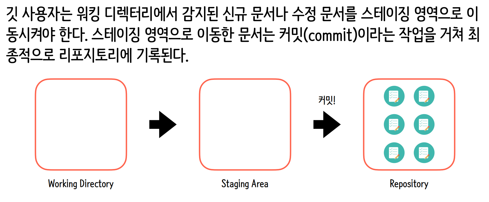

# git CLI 환경설정

```bash
Administrator@DESKTOP-IKK5VVH MINGW64 /c/Projects/Workspace/git
// 깃 저장소에서 사용할 사용자 정보 중 사용자명을 설정하는 깃 명령어
$ git config --global user.name "minuetchoi.dev"

Administrator@DESKTOP-IKK5VVH MINGW64 /c/Projects/Workspace/git
// 깃 저장소에서 사용할 사용자 정보 중 사용자 메일 주소를 설정하는 깃 명령어
$ git config --global user.email "minuetchoi.dev@gmail.com"

Administrator@DESKTOP-IKK5VVH MINGW64 /c/Projects/Workspace/git
// 사용자명 확인 명령어
$ git config user.name
minuetchoi.dev

Administrator@DESKTOP-IKK5VVH MINGW64 /c/Projects/Workspace/git
// 이메일 확인 명령어
$ git config user.email
minuetchoi.dev@gmail.com

Administrator@DESKTOP-IKK5VVH MINGW64 /c/Projects/Workspace/git
// 터미널이 열려 있는 폴더를 깃 저장소롤 초기화하는 깃 명령어
$ git init
Initialized empty Git repository in C:/Projects/Workspace/git/.git/

Administrator@DESKTOP-IKK5VVH MINGW64 /c/Projects/Workspace/git (master)
$ ls -al
total 4
drwxr-xr-x 1 Administrator 197121 0 Jan 27 10:47 ./
drwxr-xr-x 1 Administrator 197121 0 Jan 27 10:41 ../
drwxr-xr-x 1 Administrator 197121 0 Jan 27 10:47 .git/

Administrator@DESKTOP-IKK5VVH MINGW64 /c/Projects/Workspace/git (master)
// 전체 설정 목록 확인 명령어
$ git config --list
diff.astextplain.textconv=astextplain
filter.lfs.clean=git-lfs clean -- %f
filter.lfs.smudge=git-lfs smudge -- %f
filter.lfs.process=git-lfs filter-process
filter.lfs.required=true
http.sslbackend=schannel
core.autocrlf=true
core.fscache=true
core.symlinks=false
pull.rebase=false
credential.helper=manager
credential.https://dev.azure.com.usehttppath=true
init.defaultbranch=master
core.autocrlf=true
user.name=minuetchoi.dev
user.email=minuetchoi.dev@gmail.com
difftool.sourcetree.cmd=''
mergetool.sourcetree.cmd=''
mergetool.sourcetree.trustexitcode=false
mergetool.sourcetree.keepbackup=false
core.repositoryformatversion=0
core.filemode=false
core.bare=false
core.logallrefupdates=true
core.symlinks=false
core.ignorecase=true

Administrator@DESKTOP-IKK5VVH MINGW64 /c/Projects/Workspace/git/.git (GIT_DIR!)
$ ls -al
total 11
drwxr-xr-x 1 Administrator 197121   0 Jan 27 10:47 ./
drwxr-xr-x 1 Administrator 197121   0 Jan 27 10:47 ../
-rw-r--r-- 1 Administrator 197121  23 Jan 27 10:47 HEAD
-rw-r--r-- 1 Administrator 197121 130 Jan 27 10:47 config
-rw-r--r-- 1 Administrator 197121  73 Jan 27 10:47 description
drwxr-xr-x 1 Administrator 197121   0 Jan 27 10:47 hooks/
drwxr-xr-x 1 Administrator 197121   0 Jan 27 10:47 info/
drwxr-xr-x 1 Administrator 197121   0 Jan 27 10:47 objects/
drwxr-xr-x 1 Administrator 197121   0 Jan 27 10:47 refs/

Administrator@DESKTOP-IKK5VVH MINGW64 /c/Projects/Workspace/git/.git (GIT_DIR!)
$
```

<br>

> .git 구성 요소

| | |
| :---: | :--- |
| objects/ | Git의 ``데이터 저장소``입니다. 모든 파일의 내용과 커밋 메시지 등이 압축된 형태(hash)로 이곳에 저장됩니다. Git이 `버전`을 기억하는 핵심 장소입니다. |
| refs/ | `참조(References)`의 약자로, 브랜치(heads)나 태그(tag)가 현재 어떤 커밋을 가르키고 있는지에 대한 정보가 담겨 있습니다.
| hooks/ | 특정 이벤트(예:커밋 전, 푸시 전)가 발생할 때 자동으로 실행될 스크립트 예시들이 들어있습니다. (예: 커밋 메시지 형식을 강제하고 싶을 때 사용)
| info/ | .gitignore와 비슷하게 무시할 파일 패턴을 정의할 수 있는 exclude 파일이 들어 있습니다. (단, 프로젝트 전역이 아닌 나만 무시하고 싶을 때 사용)
| HEAD | 현재 내가 어떤 브랜치에서 작업 중인지를 가르키는 포인터입니다. 보통 ref: refs/heads/main처럼 현재 브랜치의 위치를 기록합니다.
| config | 해당 프로젝트에만 적용되는 설정 파일입니다. 아까 질문하신 user.name을 --global 없이 설정하면 바로 이 파일에 저장됩니다.
| description | GitWeb 같은 프로그램에서 프로젝트 설명을 표시할 때 사용합니다. 일반적인 개발 과정에서는 거의 건드리지 않습니다. |

<br>

> .git 저장소 관리








> git CLI 기본명령어

```bash
Administrator@DESKTOP-IKK5VVH MINGW64 /c/Projects/Workspace/git (master)
$ touch text1.txt

Administrator@DESKTOP-IKK5VVH MINGW64 /c/Projects/Workspace/git (master)
$ ls
text1.txt

Administrator@DESKTOP-IKK5VVH MINGW64 /c/Projects/Workspace/git (master)
$ echo "우리의 첫 텍스트문서" > text1.txt

Administrator@DESKTOP-IKK5VVH MINGW64 /c/Projects/Workspace/git (master)
$ git status
On branch master

No commits yet

Untracked files:
  (use "git add <file>..." to include in what will be committed)
        text1.txt

nothing added to commit but untracked files present (use "git add" to track)

Administrator@DESKTOP-IKK5VVH MINGW64 /c/Projects/Workspace/git (master)
$ git status
On branch master

No commits yet

Changes to be committed:
  (use "git rm --cached <file>..." to unstage)
        new file:   text1.txt


Administrator@DESKTOP-IKK5VVH MINGW64 /c/Projects/Workspace/git (master)
$ git add

[master (root-commit) a9a83c4] 나의 첫번째 커밋 작업
 1 file changed, 1 insertion(+)
 create mode 100644 text1.txt

Administrator@DESKTOP-IKK5VVH MINGW64 /c/Projects/Workspace/git (master)
$ git status
On branch master
nothing to commit, working tree clean

$ git log
commit a9a83c410646918622a33d203ffce6f09f2c57e7 (HEAD -> master)
Author: minuetchoi.dev <minuetchoi.dev@gmail.com>
Date:   Tue Jan 27 11:53:02 2026 +0900

    나의 첫번째 커밋 작업

Administrator@DESKTOP-IKK5VVH MINGW64 /c/Projects/Workspace/git (master)
$

Administrator@DESKTOP-IKK5VVH MINGW64 /c/Projects/Workspace/git (master)
$ echo "두번째 수정사항을 남기고 싶어" >> text1.txt

Administrator@DESKTOP-IKK5VVH MINGW64 /c/Projects/Workspace/git (master)
$ git status
On branch master
Changes not staged for commit:
  (use "git add <file>..." to update what will be committed)
  (use "git restore <file>..." to discard changes in working directory)
        modified:   text1.txt

no changes added to commit (use "git add" and/or "git commit -a")

Administrator@DESKTOP-IKK5VVH MINGW64 /c/Projects/Workspace/git (master)
$ git add .

Administrator@DESKTOP-IKK5VVH MINGW64 /c/Projects/Workspace/git (master)
$ git status
On branch master
Changes to be committed:
  (use "git restore --staged <file>..." to unstage)
        modified:   text1.txt


Administrator@DESKTOP-IKK5VVH MINGW64 /c/Projects/Workspace/git (master)
$


```