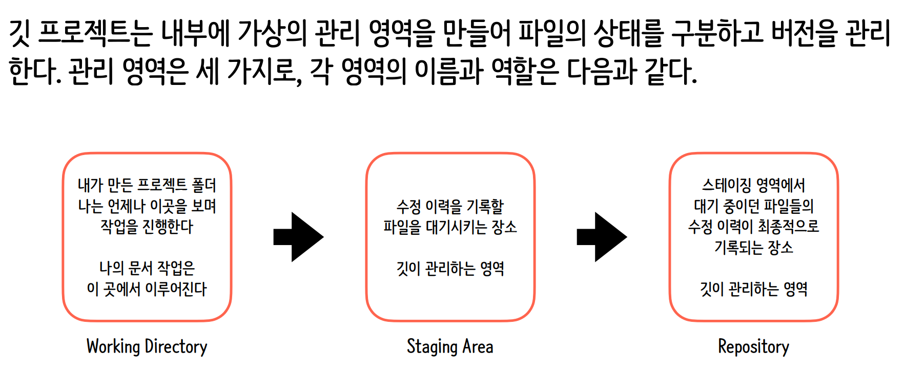
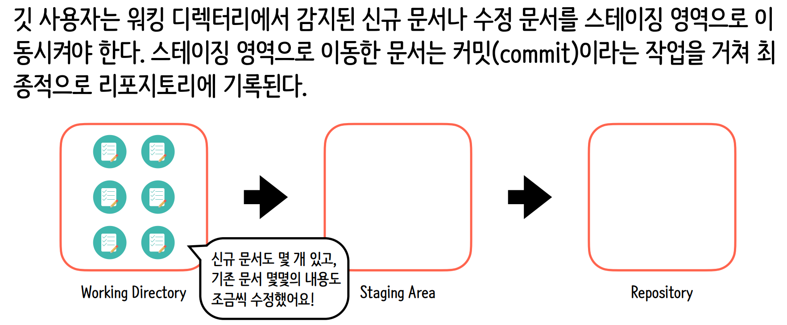
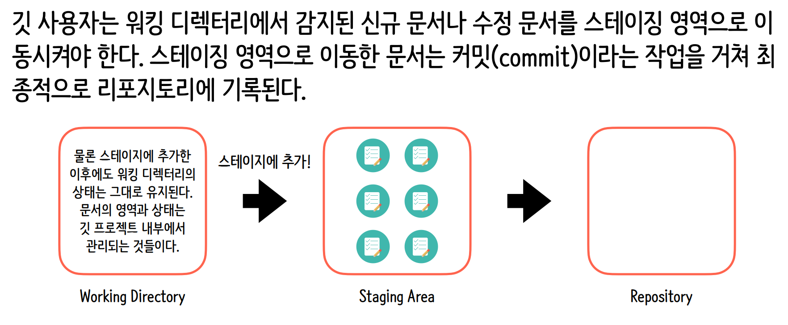
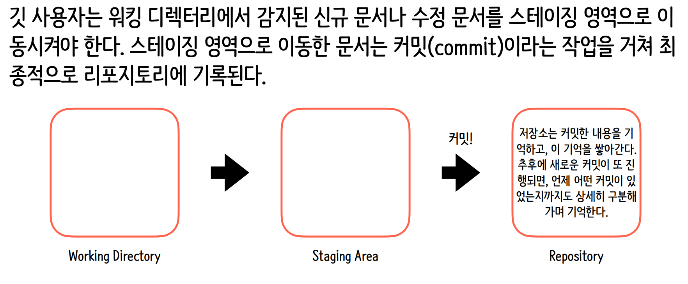

# ☑️ Git Feature Branch 전략 가이드

**Git Feature 전략**은 새로운 기능 개발 시 메인 코드라인에서 독립된 브랜치를 분기하여 작업하고, 개발이 완료되면 다시 통합하는 방식입니다. 프로젝트의 안정성을 유지하면서 여러 개발자가 동시에 협업할 수 있는 핵심 전략입니다.

<br>

## 1. 핵심 브랜치 구조


| 브랜치 이름 | 역할 | 특징 |
| :--- | :--- | :--- |
| **main** (master) | 제품 출시 가능한 상태 | 직접적인 커밋 금지, 최종 승인 후 병합 |
| **develop** | 다음 출시를 위한 통합 브랜치 | 모든 Feature 브랜치의 목적지 |
| **feature/** | 실제 기능 개발 | `feature/login`과 같이 기능별로 생성 및 삭제 |

<br>

## 2. 표준 작업 프로세스 (Workflow)

1. **분기 생성**: `develop` 브랜치에서 최신 코드를 받아 새 기능 브랜치를 만듭니다.
2. **독립 개발**: 기능 단위로 커밋(`commit`)을 남기며 개발을 진행합니다.
3. **원격 공유**: 코드 리뷰를 위해 원격 저장소에 `push`합니다.
4. **검토 및 병합**: Pull Request(PR)를 통해 팀원의 검토를 거친 후 `develop`에 병합합니다.
5. **정리**: 사용이 끝난 Feature 브랜치를 삭제합니다.

<br>

## 3. 실무 명령어 시나리오

| 단계 | 실행 명령어 | 설명 |
| :---: | :--- | :--- |
| **1** | `git checkout develop` | 기준이 되는 develop 브랜치로 이동 |
| **2** | `git pull origin develop` | 최신 코드 상태 업데이트 |
| **3** | `git checkout -b feature/user-profile` | 새 기능 브랜치 생성 및 이동 |
| **4** | `git add .` <br> `git commit -m "Add profile UI"` | 기능 개발 및 기록 |
| **5** | `git push origin feature/user-profile` | 원격 저장소에 업로드 (PR 생성 단계) |
| **6** | `git checkout develop` <br> `git merge feature/user-profile` | (검토 완료 후) develop에 병합 |
| **7** | `git branch -d feature/user-profile` | 로컬 브랜치 삭제 |

<br>

## 4. 전략 도입의 장점

* **병렬 개발 가능**: 서로 다른 기능을 가진 개발자들이 충돌 없이 동시에 작업할 수 있습니다.
* **배포 안정성**: 개발 중인 미완성 코드가 메인 서비스에 영향을 주지 않습니다.
* **히스토리 관리**: 어떤 기능이 언제, 왜 추가되었는지 브랜치 단위로 명확히 파악할 수 있습니다.

> **💡 Tip: 네이밍 규칙**
> 브랜치명은 `feature/issue-number-description` 형식을 사용하면 더 체계적인 관리가 가능합니다. (예: `feature/12-social-login`)


<br><br>


# ☑️ Git CLI 핵심 명령어 정리

## 1. 환경 설정 및 초기화 (Config & Init)

Git 사용을 위한 사용자 정보 설정과 저장소 생성을 담당합니다.

| 분류 | 명령어 | 설명 | 비고 |
| :--- | :--- | :--- | :--- |
| **설정** | `git config --global user.name "이름"` | 전역 사용자 이름 설정 | --global은 PC 전체 적용 |
| **설정** | `git config --global user.email "메일"` | 전역 사용자 이메일 설정 | GitHub 계정 메일 권장 |
| **확인** | `git config --list` | 설정된 모든 환경 정보 확인 | 사용자 정보 및 에디터 확인 |
| **초기화** | `git init` | 현재 폴더를 Git 저장소로 초기화 | `.git` 폴더 생성 |

<br>

## 2. 기본 작업 흐름 (Add, Commit, Status)

파일의 변경사항을 추적하고 버전을 기록하는 핵심 단계입니다.


| 분류 | 명령어 | 설명 | 비고 |
| :--- | :--- | :--- | :--- |
| **상태** | `git status` | 현재 저장소의 파일 상태 확인 | Untracked, Staged 등 확인 |
| **스테이징** | `git add <파일명>` | 특정 파일을 Stage 영역에 추가 | 커밋 전 준비 단계 |
| **스테이징** | `git add .` | 수정된 모든 파일을 한꺼번에 추가 | 현재 디렉토리 기준 |
| **기록** | `git commit -m "메시지"` | Stage에 올라온 파일들로 버전 생성 | 의미 있는 메시지 작성 |
| **조회** | `git log` | 전체 커밋 히스토리 확인 | 해시, 작성자, 날짜 표시 |
| **조회** | `git log --oneline` | 커밋 히스토리를 한 줄로 간결하게 표시 | 전체 흐름 파악에 용이 |

<br>

## 3. 변경 사항 확인 및 복구 (Check & Reset)

과거의 내용을 확인하거나 실수를 바로잡을 때 사용합니다.

| 분류 | 명령어 | 설명 | 비고 |
| :--- | :--- | :--- | :--- |
| **비교** | `git log -p` | 커밋의 상세 변경 내용(diff) 확인 | 코드의 구체적인 변화 파악 |
| **이동** | `git checkout <해시>` | 특정 커밋 시점으로 코드 상태 변경 | 과거 시점으로 '시간 여행' |
| **취소** | `git reset <파일>` | Stage에 올라간 파일을 다시 내리기 | `add` 취소 |
| **취소** | `git reset --hard <해시>` | 특정 커밋으로 완전히 되돌리기 | **주의:** 이후 작업물 삭제됨 |
| **복구** | `git revert <해시>` | 특정 커밋 내용을 취소하는 새 커밋 생성 | 히스토리를 보존하는 복구 |
| **기록** | `git reflog` | 헤드(HEAD)가 가리켰던 모든 기록 조회 | 삭제한 커밋을 찾을 때 필수 |

<br>

## 4. 브랜치 관리 (Branching)

독립적인 작업 공간을 만들고 합치는 기능입니다.


| 분류 | 명령어 | 설명 | 비고 |
| :--- | :--- | :--- | :--- |
| **조회** | `git branch` | 브랜치 목록 확인 | `*` 표시가 현재 브랜치 |
| **생성** | `git branch <이름>` | 새로운 브랜치 생성 | 현재 시점에서 분기 생성 |
| **이동** | `git checkout <이름>` | 해당 브랜치로 작업 환경 전환 | `git switch`로도 사용 가능 |
| **병합** | `git merge <대상>` | 현재 브랜치에 대상 브랜치 합침 | 주로 메인 브랜치에서 실행 |
| **삭제** | `git branch -d <이름>` | 사용이 끝난 브랜치 삭제 | 머지 완료 후 정리 용도 |

<br>

## 5. 원격 저장소 상호작용 (Remote)
GitHub 등 외부 저장소와 협업하기 위한 명령어입니다.

| 분류 | 명령어 | 설명 | 비고 |
| :--- | :--- | :--- | :--- |
| **연결** | `git remote add origin <URL>` | 원격 저장소 주소 연결 |

<br><br>

# ☑️ Git 머지 충돌(Merge Conflict) 발생 및 해결 방법

## 1. 충돌 내용 해석하기
`cat text.txt`로 확인한 내용은 아래와 같은 의미를 가집니다.

* **`<<<<<<< HEAD`**: 현재 내가 위치한 브랜치(`master`)의 내용 시작
* **`=======`**: 두 브랜치 내용 사이의 **구분선**
* **`>>>>>>> freature/user1`**: 합치려고 가져온 브랜치(`freature/user1`)의 내용 끝

---

## 2. 해결 단계

### Step 1: 파일 수정 (에디터 사용)
메모장, VS Code, 혹은 `vim` 같은 에디터로 `text.txt` 파일을 엽니다. 특수 기호들을 모두 삭제하고 **최종적으로 남길 내용**만 적습니다.

**예시 (두 내용을 모두 유지할 경우):**

```bash
origin master
freature/user1
```

### Step 1: 파일 수정 (에디터 사용)

충돌 해결이 완료되었음을 Git에 알립니다.

```bash
git add .
```

### Step 3: 병합 마무리 (commit)

```bash
git commit -u "병합 해결"
```

### 4. 추가 팁: 병합 취소하기

상황이 꼬여서 병합 시도 전으로 되돌리고 싶다면 아래 명령어를 사용합니다.

```bash
git merge --abort
```

<br><br>

# ☑️ 실습

## git CLI 환경설정

```bash
Administrator@DESKTOP-IKK5VVH MINGW64 /c/Projects/Workspace/git
// 깃 저장소에서 사용할 사용자 정보 중 사용자명을 설정하는 깃 명령어
$ git config --global user.name "minuetchoi.dev"

Administrator@DESKTOP-IKK5VVH MINGW64 /c/Projects/Workspace/git
// 깃 저장소에서 사용할 사용자 정보 중 사용자 메일 주소를 설정하는 깃 명령어
$ git config --global user.email "minuetchoi.dev@gmail.com"

Administrator@DESKTOP-IKK5VVH MINGW64 /c/Projects/Workspace/git
// 사용자명 확인 명령어
$ git config user.name
minuetchoi.dev

Administrator@DESKTOP-IKK5VVH MINGW64 /c/Projects/Workspace/git
// 이메일 확인 명령어
$ git config user.email
minuetchoi.dev@gmail.com

Administrator@DESKTOP-IKK5VVH MINGW64 /c/Projects/Workspace/git
// 터미널이 열려 있는 폴더를 깃 저장소롤 초기화하는 깃 명령어
$ git init
Initialized empty Git repository in C:/Projects/Workspace/git/.git/

Administrator@DESKTOP-IKK5VVH MINGW64 /c/Projects/Workspace/git (master)
$ ls -al
total 4
drwxr-xr-x 1 Administrator 197121 0 Jan 27 10:47 ./
drwxr-xr-x 1 Administrator 197121 0 Jan 27 10:41 ../
drwxr-xr-x 1 Administrator 197121 0 Jan 27 10:47 .git/

Administrator@DESKTOP-IKK5VVH MINGW64 /c/Projects/Workspace/git (master)
// 전체 설정 목록 확인 명령어
$ git config --list
diff.astextplain.textconv=astextplain
filter.lfs.clean=git-lfs clean -- %f
filter.lfs.smudge=git-lfs smudge -- %f
filter.lfs.process=git-lfs filter-process
filter.lfs.required=true
http.sslbackend=schannel
core.autocrlf=true
core.fscache=true
core.symlinks=false
pull.rebase=false
credential.helper=manager
credential.https://dev.azure.com.usehttppath=true
init.defaultbranch=master
core.autocrlf=true
user.name=minuetchoi.dev
user.email=minuetchoi.dev@gmail.com
difftool.sourcetree.cmd=''
mergetool.sourcetree.cmd=''
mergetool.sourcetree.trustexitcode=false
mergetool.sourcetree.keepbackup=false
core.repositoryformatversion=0
core.filemode=false
core.bare=false
core.logallrefupdates=true
core.symlinks=false
core.ignorecase=true

Administrator@DESKTOP-IKK5VVH MINGW64 /c/Projects/Workspace/git/.git (GIT_DIR!)
$ ls -al
total 11
drwxr-xr-x 1 Administrator 197121   0 Jan 27 10:47 ./
drwxr-xr-x 1 Administrator 197121   0 Jan 27 10:47 ../
-rw-r--r-- 1 Administrator 197121  23 Jan 27 10:47 HEAD
-rw-r--r-- 1 Administrator 197121 130 Jan 27 10:47 config
-rw-r--r-- 1 Administrator 197121  73 Jan 27 10:47 description
drwxr-xr-x 1 Administrator 197121   0 Jan 27 10:47 hooks/
drwxr-xr-x 1 Administrator 197121   0 Jan 27 10:47 info/
drwxr-xr-x 1 Administrator 197121   0 Jan 27 10:47 objects/
drwxr-xr-x 1 Administrator 197121   0 Jan 27 10:47 refs/

Administrator@DESKTOP-IKK5VVH MINGW64 /c/Projects/Workspace/git/.git (GIT_DIR!)
$
```

<br>

> .git 구성 요소

| | |
| :---: | :--- |
| objects/ | Git의 ``데이터 저장소``입니다. 모든 파일의 내용과 커밋 메시지 등이 압축된 형태(hash)로 이곳에 저장됩니다. Git이 `버전`을 기억하는 핵심 장소입니다. |
| refs/ | `참조(References)`의 약자로, 브랜치(heads)나 태그(tag)가 현재 어떤 커밋을 가르키고 있는지에 대한 정보가 담겨 있습니다.
| hooks/ | 특정 이벤트(예:커밋 전, 푸시 전)가 발생할 때 자동으로 실행될 스크립트 예시들이 들어있습니다. (예: 커밋 메시지 형식을 강제하고 싶을 때 사용)
| info/ | .gitignore와 비슷하게 무시할 파일 패턴을 정의할 수 있는 exclude 파일이 들어 있습니다. (단, 프로젝트 전역이 아닌 나만 무시하고 싶을 때 사용)
| HEAD | 현재 내가 어떤 브랜치에서 작업 중인지를 가르키는 포인터입니다. 보통 ref: refs/heads/main처럼 현재 브랜치의 위치를 기록합니다.
| config | 해당 프로젝트에만 적용되는 설정 파일입니다. 아까 질문하신 user.name을 --global 없이 설정하면 바로 이 파일에 저장됩니다.
| description | GitWeb 같은 프로그램에서 프로젝트 설명을 표시할 때 사용합니다. 일반적인 개발 과정에서는 거의 건드리지 않습니다. |

<br>

> .git 저장소 관리








> git CLI 기본명령어

```bash
Administrator@DESKTOP-IKK5VVH MINGW64 /c/Projects/Workspace/git (master)
$ touch text1.txt

Administrator@DESKTOP-IKK5VVH MINGW64 /c/Projects/Workspace/git (master)
$ ls
text1.txt

Administrator@DESKTOP-IKK5VVH MINGW64 /c/Projects/Workspace/git (master)
$ echo "우리의 첫 텍스트문서" > text1.txt

Administrator@DESKTOP-IKK5VVH MINGW64 /c/Projects/Workspace/git (master)
$ git status
On branch master

No commits yet

Untracked files:
  (use "git add <file>..." to include in what will be committed)
        text1.txt

nothing added to commit but untracked files present (use "git add" to track)

Administrator@DESKTOP-IKK5VVH MINGW64 /c/Projects/Workspace/git (master)
$ git status
On branch master

No commits yet

Changes to be committed:
  (use "git rm --cached <file>..." to unstage)
        new file:   text1.txt


Administrator@DESKTOP-IKK5VVH MINGW64 /c/Projects/Workspace/git (master)
$ git add

[master (root-commit) a9a83c4] 나의 첫번째 커밋 작업
 1 file changed, 1 insertion(+)
 create mode 100644 text1.txt

Administrator@DESKTOP-IKK5VVH MINGW64 /c/Projects/Workspace/git (master)
$ git status
On branch master
nothing to commit, working tree clean

$ git log
commit a9a83c410646918622a33d203ffce6f09f2c57e7 (HEAD -> master)
Author: minuetchoi.dev <minuetchoi.dev@gmail.com>
Date:   Tue Jan 27 11:53:02 2026 +0900

    나의 첫번째 커밋 작업

Administrator@DESKTOP-IKK5VVH MINGW64 /c/Projects/Workspace/git (master)
$

Administrator@DESKTOP-IKK5VVH MINGW64 /c/Projects/Workspace/git (master)
$ echo "두번째 수정사항을 남기고 싶어" >> text1.txt

Administrator@DESKTOP-IKK5VVH MINGW64 /c/Projects/Workspace/git (master)
$ git status
On branch master
Changes not staged for commit:
  (use "git add <file>..." to update what will be committed)
  (use "git restore <file>..." to discard changes in working directory)
        modified:   text1.txt

no changes added to commit (use "git add" and/or "git commit -a")

Administrator@DESKTOP-IKK5VVH MINGW64 /c/Projects/Workspace/git (master)
$ git add .

Administrator@DESKTOP-IKK5VVH MINGW64 /c/Projects/Workspace/git (master)
$ git status
On branch master
Changes to be committed:
  (use "git restore --staged <file>..." to unstage)
        modified:   text1.txt


Administrator@DESKTOP-IKK5VVH MINGW64 /c/Projects/Workspace/git (master)
$ echo "세번째 수정사항을 남기고 싶어" >> text1.txt

Administrator@DESKTOP-IKK5VVH MINGW64 /c/Projects/Workspace/git (master)
$ git add .

Administrator@DESKTOP-IKK5VVH MINGW64 /c/Projects/Workspace/git (master)
$ git commit -m "My second commit"
[master 71253c4] My second commit
 1 file changed, 2 insertions(+)

Administrator@DESKTOP-IKK5VVH MINGW64 /c/Projects/Workspace/git (master)
$ git log -p
commit 71253c44c6ffce30b1e2d0249cae67fd8ee46431 (HEAD -> master)
Author: minuetchoi.dev <minuetchoi.dev@gmail.com>
Date:   Tue Jan 27 12:59:50 2026 +0900

    My second commit

diff --git a/text1.txt b/text1.txt
index 9fbf77a..a11303d 100644
--- a/text1.txt
+++ b/text1.txt
@@ -1 +1,3 @@
 우리의 첫 텍스트문서
+두번째 수정사항을 남기고 싶어
+세번째 수정사항을 남기고 싶어

commit a9a83c410646918622a33d203ffce6f09f2c57e7
Author: minuetchoi.dev <minuetchoi.dev@gmail.com>
Date:   Tue Jan 27 11:53:02 2026 +0900

    나의 첫번째 커밋 작업

diff --git a/text1.txt b/text1.txt
new file mode 100644
index 0000000..9fbf77a
--- /dev/null
+++ b/text1.txt
@@ -0,0 +1 @@
+우리의 첫 텍스트문서

Administrator@DESKTOP-IKK5VVH MINGW64 /c/Projects/Workspace/git (master)
$ git log -1
commit 71253c44c6ffce30b1e2d0249cae67fd8ee46431 (HEAD -> master)
Author: minuetchoi.dev <minuetchoi.dev@gmail.com>
Date:   Tue Jan 27 12:59:50 2026 +0900

    My second commit

Administrator@DESKTOP-IKK5VVH MINGW64 /c/Projects/Workspace/git (master)
$ git log -p -1
commit 71253c44c6ffce30b1e2d0249cae67fd8ee46431 (HEAD -> master)
Author: minuetchoi.dev <minuetchoi.dev@gmail.com>
Date:   Tue Jan 27 12:59:50 2026 +0900

    My second commit

diff --git a/text1.txt b/text1.txt
index 9fbf77a..a11303d 100644
--- a/text1.txt
+++ b/text1.txt
@@ -1 +1,3 @@
 우리의 첫 텍스트문서
+두번째 수정사항을 남기고 싶어
+세번째 수정사항을 남기고 싶어

Administrator@DESKTOP-IKK5VVH MINGW64 /c/Projects/Workspace/git (master)
$ git log --oneline
71253c4 (HEAD -> master) My second commit
a9a83c4 나의 첫번째 커밋 작업

Administrator@DESKTOP-IKK5VVH MINGW64 /c/Projects/Workspace/git (master)
$ git checkout a9a83c4
Note: switching to 'a9a83c4'.

You are in 'detached HEAD' state. You can look around, make experimental
changes and commit them, and you can discard any commits you make in this
state without impacting any branches by switching back to a branch.

If you want to create a new branch to retain commits you create, you may
do so (now or later) by using -c with the switch command. Example:

  git switch -c <new-branch-name>

Or undo this operation with:

  git switch -

Turn off this advice by setting config variable advice.detachedHead to false

HEAD is now at a9a83c4 나의 첫번째 커밋 작업

Administrator@DESKTOP-IKK5VVH MINGW64 /c/Projects/Workspace/git ((a9a83c4...))
$ cat text1.txt
우리의 첫 텍스트문서

Administrator@DESKTOP-IKK5VVH MINGW64 /c/Projects/Workspace/git ((a9a83c4...))
$ git reflog
a9a83c4 (HEAD) HEAD@{0}: checkout: moving from master to a9a83c4
71253c4 (master) HEAD@{1}: commit: My second commit
a9a83c4 (HEAD) HEAD@{2}: commit (initial): 나의 첫번째 커밋 작업

Administrator@DESKTOP-IKK5VVH MINGW64 /c/Projects/Workspace/git ((a9a83c4...))
$ git checkout master
Previous HEAD position was a9a83c4 나의 첫번째 커밋 작업
Switched to branch 'master'

Administrator@DESKTOP-IKK5VVH MINGW64 /c/Projects/Workspace/git (master)
$ cat text1.txt
우리의 첫 텍스트문서
두번째 수정사항을 남기고 싶어
세번째 수정사항을 남기고 싶어

Administrator@DESKTOP-IKK5VVH MINGW64 /c/Projects/Workspace/git (master)
$

```

> git 브랜치

```bash
Administrator@DESKTOP-IKK5VVH MINGW64 /c/Projects/Workspace/git (master)
$ echo "실수 상황을 굳이 만들어보고 있는 중" > mistake.txt

Administrator@DESKTOP-IKK5VVH MINGW64 /c/Projects/Workspace/git (master)
$ git status
On branch master
Untracked files:
  (use "git add <file>..." to include in what will be committed)
        mistake.txt

nothing added to commit but untracked files present (use "git add" to track)

Administrator@DESKTOP-IKK5VVH MINGW64 /c/Projects/Workspace/git (master)
$ git add mistake.txt

Administrator@DESKTOP-IKK5VVH MINGW64 /c/Projects/Workspace/git (master)
$ git status
On branch master
Changes to be committed:
  (use "git restore --staged <file>..." to unstage)
        new file:   mistake.txt


Administrator@DESKTOP-IKK5VVH MINGW64 /c/Projects/Workspace/git (master)
$ git reset mistake.txt

Administrator@DESKTOP-IKK5VVH MINGW64 /c/Projects/Workspace/git (master)
$ git status
On branch master
Untracked files:
  (use "git add <file>..." to include in what will be committed)
        mistake.txt

nothing added to commit but untracked files present (use "git add" to track)

Administrator@DESKTOP-IKK5VVH MINGW64 /c/Projects/Workspace/git (master)
$ git add mistake.txt

Administrator@DESKTOP-IKK5VVH MINGW64 /c/Projects/Workspace/git (master)
$ git commit -m "first commit"
[master a8e882e] first commit
 1 file changed, 1 insertion(+)
 create mode 100644 mistake.txt

Administrator@DESKTOP-IKK5VVH MINGW64 /c/Projects/Workspace/git (master)
$ git log -1
commit a8e882eefddb70ef0854abeca3665af33aba86c8 (HEAD -> master)
Author: minuetchoi.dev <minuetchoi.dev@gmail.com>
Date:   Tue Jan 27 15:54:21 2026 +0900

    first commit

Administrator@DESKTOP-IKK5VVH MINGW64 /c/Projects/Workspace/git (master)
$ echo "실수를 계속해서 만들어보는중" >> mistake.txt

Administrator@DESKTOP-IKK5VVH MINGW64 /c/Projects/Workspace/git (master)
$ git status
On branch master
Changes not staged for commit:
  (use "git add <file>..." to update what will be committed)
  (use "git restore <file>..." to discard changes in working directory)
        modified:   mistake.txt

no changes added to commit (use "git add" and/or "git commit -a")

Administrator@DESKTOP-IKK5VVH MINGW64 /c/Projects/Workspace/git (master)
$ git add .

Administrator@DESKTOP-IKK5VVH MINGW64 /c/Projects/Workspace/git (master)
$ git status
On branch master
Changes to be committed:
  (use "git restore --staged <file>..." to unstage)
        modified:   mistake.txt


Administrator@DESKTOP-IKK5VVH MINGW64 /c/Projects/Workspace/git (master)
$ git commit -m "mistake commit"
[master a3847c2] mistake commit
 1 file changed, 1 insertion(+)

Administrator@DESKTOP-IKK5VVH MINGW64 /c/Projects/Workspace/git (master)
$ git log --oneline
a3847c2 (HEAD -> master) mistake commit
a8e882e first commit
71253c4 My second commit
a9a83c4 나의 첫번째 커밋 작업

Administrator@DESKTOP-IKK5VVH MINGW64 /c/Projects/Workspace/git (master)
$ git reset a8e882e --hard
HEAD is now at a8e882e first commit

Administrator@DESKTOP-IKK5VVH MINGW64 /c/Projects/Workspace/git (master)
$ git status
On branch master
nothing to commit, working tree clean

Administrator@DESKTOP-IKK5VVH MINGW64 /c/Projects/Workspace/git (master)
$ echo "추가 실수" > add-mistake.txt

Administrator@DESKTOP-IKK5VVH MINGW64 /c/Projects/Workspace/git (master)
$ git add .

Administrator@DESKTOP-IKK5VVH MINGW64 /c/Projects/Workspace/git (master)
$ git commit -m "second commit"

Administrator@DESKTOP-IKK5VVH MINGW64 /c/Projects/Workspace/git (master)
$ git revert c149b84 -m "revert done"

[master 90dbcdf] Revert "second commit"
 1 file changed, 1 deletion(-)
 delete mode 100644 add-mistake.txt

```

> git branch

```bash
Administrator@DESKTOP-IKK5VVH MINGW64 /c/Projects/Workspace/git-branch-test (master)
$ git branch
* master

Administrator@DESKTOP-IKK5VVH MINGW64 /c/Projects/Workspace/git-branch-test (master)
$ git branch develop

Administrator@DESKTOP-IKK5VVH MINGW64 /c/Projects/Workspace/git-branch-test (master)
$ git branch
  develop
* master

Administrator@DESKTOP-IKK5VVH MINGW64 /c/Projects/Workspace/git-branch-test (master)
$ git checkout develop
Switched to branch 'develop'

Administrator@DESKTOP-IKK5VVH MINGW64 /c/Projects/Workspace/git-branch-test (develop)
$ git branch
* develop
  master

Administrator@DESKTOP-IKK5VVH MINGW64 /c/Projects/Workspace/git-branch-test (develop)
$ echo "실험적인 문서를 develop 브랜치에서 추가해 보았다.!" > test.txt

Administrator@DESKTOP-IKK5VVH MINGW64 /c/Projects/Workspace/git-branch-test (develop)
$ git status
On branch develop
Untracked files:
  (use "git add <file>..." to include in what will be committed)
        test.txt

nothing added to commit but untracked files present (use "git add" to track)

Administrator@DESKTOP-IKK5VVH MINGW64 /c/Projects/Workspace/git-branch-test (develop)
$ git add .

Administrator@DESKTOP-IKK5VVH MINGW64 /c/Projects/Workspace/git-branch-test (develop)
$ git commit -m "thrid commit"
[develop 129d661] thrid commit
 1 file changed, 1 insertion(+)
 create mode 100644 test.txt

Administrator@DESKTOP-IKK5VVH MINGW64 /c/Projects/Workspace/git-branch-test (develop)
$ git log --oneline
129d661 (HEAD -> develop) thrid commit
25e9f0b (master) second commit
bed0620 first commit

Administrator@DESKTOP-IKK5VVH MINGW64 /c/Projects/Workspace/git-branch-test (develop)
$ git checkout master
Switched to branch 'master'

Administrator@DESKTOP-IKK5VVH MINGW64 /c/Projects/Workspace/git-branch-test (master)
$ git log --oneline
25e9f0b (HEAD -> master) second commit
bed0620 first commit

Administrator@DESKTOP-IKK5VVH MINGW64 /c/Projects/Workspace/git-branch-test (master)
$ git merge develop
Updating 25e9f0b..129d661
Fast-forward
 test.txt | 1 +
 1 file changed, 1 insertion(+)
 create mode 100644 test.txt

Administrator@DESKTOP-IKK5VVH MINGW64 /c/Projects/Workspace/git-branch-test (master)
$ git log --oneline
129d661 (HEAD -> master, develop) thrid commit
25e9f0b second commit
bed0620 first commit

Administrator@DESKTOP-IKK5VVH MINGW64 /c/Projects/Workspace/git-branch-test (master)
$ git branch -d develop
Deleted branch develop (was 129d661).

Administrator@DESKTOP-IKK5VVH MINGW64 /c/Projects/Workspace/git-branch-test (master)
$ git branch
* master

```

> git remote repository

```bash
Administrator@DESKTOP-IKK5VVH MINGW64 /c/Projects/Workspace/git-remote-test (master)
$ git remote add origin https://github.com/minuetchoidev/git-study.git

Administrator@DESKTOP-IKK5VVH MINGW64 /c/Projects/Workspace/git-remote-test (master)
$ git remote -v
origin  https://github.com/minuetchoidev/git-study.git (fetch)
origin  https://github.com/minuetchoidev/git-study.git (push)

Administrator@DESKTOP-IKK5VVH MINGW64 /c/Projects/Workspace/git-remote-test (master)
$ ls
text.txt

Administrator@DESKTOP-IKK5VVH MINGW64 /c/Projects/Workspace/git-remote-test (master)
$ git push
fatal: The current branch master has no upstream branch.
To push the current branch and set the remote as upstream, use

    git push --set-upstream origin master

To have this happen automatically for branches without a tracking
upstream, see 'push.autoSetupRemote' in 'git help config'.


Administrator@DESKTOP-IKK5VVH MINGW64 /c/Projects/Workspace/git-remote-test (master)
$ git push -u origin master
Enumerating objects: 3, done.
Counting objects: 100% (3/3), done.
Writing objects: 100% (3/3), 209 bytes | 209.00 KiB/s, done.
Total 3 (delta 0), reused 0 (delta 0), pack-reused 0 (from 0)
To https://github.com/minuetchoidev/git-study.git
 * [new branch]      master -> master
branch 'master' set up to track 'origin/master'.

Administrator@DESKTOP-IKK5VVH MINGW64 /c/Projects/Workspace/git-remote-test (master)
$

// clone
Administrator@DESKTOP-IKK5VVH MINGW64 /c/Projects/Workspace
$ git clone https://github.com/minuetchoidev/git-study.git
Cloning into 'git-study'...
remote: Enumerating objects: 3, done.
remote: Counting objects: 100% (3/3), done.
remote: Total 3 (delta 0), reused 3 (delta 0), pack-reused 0 (from 0)
Receiving objects: 100% (3/3), done.

Administrator@DESKTOP-IKK5VVH MINGW64 /c/Projects/Workspace
$ ls -al
total 8
drwxr-xr-x 1 Administrator 197121 0 Jan 27 16:46 ./
drwxr-xr-x 1 Administrator 197121 0 Jan 22 11:41 ../
drwxr-xr-x 1 Administrator 197121 0 Jan 27 16:46 git-study/
drwxr-xr-x 1 Administrator 197121 0 Jan 26 19:01 medis2/


Administrator@DESKTOP-IKK5VVH MINGW64 /c/Projects/Workspace/git-study (master)
$ git log --oneline
b1ba908 (HEAD -> master, origin/master, origin/HEAD) first commit

Administrator@DESKTOP-IKK5VVH MINGW64 /c/Projects/Workspace/git-study (master)
$ git pull
remote: Enumerating objects: 4, done.
remote: Counting objects: 100% (4/4), done.
remote: Compressing objects: 100% (2/2), done.
remote: Total 3 (delta 0), reused 0 (delta 0), pack-reused 0 (from 0)
Unpacking objects: 100% (3/3), 946 bytes | 86.00 KiB/s, done.
From https://github.com/minuetchoidev/git-study
   b1ba908..8b95893  master     -> origin/master
Updating b1ba908..8b95893
Fast-forward
 context.md | 1 +
 1 file changed, 1 insertion(+)
 create mode 100644 context.md

Administrator@DESKTOP-IKK5VVH MINGW64 /c/Projects/Workspace/git-study (master)
$ ls
context.md  text.txt

Administrator@DESKTOP-IKK5VVH MINGW64 /c/Projects/Workspace/git-study (master)
$
```

> merge conflict

```bash
Administrator@DESKTOP-IKK5VVH MINGW64 /c/Projects/Workspace/git-test (master)
$ cat text.txt
origin master


Administrator@DESKTOP-IKK5VVH MINGW64 /c/Projects/Workspace/git-test (master)
$ git merge freature/user1
Auto-merging text.txt
CONFLICT (content): Merge conflict in text.txt
Automatic merge failed; fix conflicts and then commit the result.

Administrator@DESKTOP-IKK5VVH MINGW64 /c/Projects/Workspace/git-test (master|MERGING)
$ cat text.txt
<<<<<<< HEAD
origin master

=======
freature/user1
>>>>>>> freature/user1
```